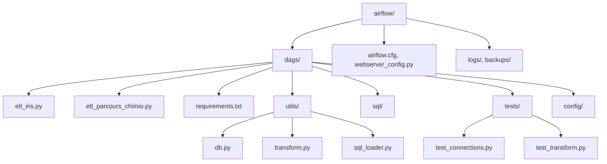

[](https://github.com/Oncopole-Claudius-Regaud/minimal-dataset/actions/workflows/ci.yml)

#  Minimal Dataset Pipeline
Ce projet est un pipeline de traitement de données cliniques basé sur le modèle OSIRIS RWD, développé dans le cadre d’un ETL automatisé pour l’IUCT Oncopole. Il permet l’extraction de données depuis Oracle & IRIS, leur transformation et leur chargement dans PostgreSQL, avec une structure conforme aux standards OSIRIS/OMOP.

---

##  Fonctionnalités principales

-  ETL automatisé via Airflow (IRIS ➝ PostgreSQL & Oracle ➝ PostgreSQL) |
-  Modélisation alignée OSIRIS RWD (Patient, Measure, Condition, TreatmentLine, etc.) |
-  Détection et journalisation des cas manquants (patients non retrouvés ou sans traitements) |
-  Tests unitaires | Connexions, transformations, vérifications de duplications |
-  CI GitHub Actions | Linting (flake8), tests automatiques |
-  Intégration future vers de la BI (Analytiques)

---

## Arborescence du projet



##  Stack technique

-  **Python 3.12**
-  **Apache Airflow**
-  **Oracle + IRIS + PostgreSQL**
-  **Pandas / cx_Oracle / psycopg2**
-  **GIT + SSH**
-  GitHub Actions pour CI

---

##  Installation

```bash
# 1. Activer l'environnement
source airflow_env/bin/activate

# 2. Installer les dépendances
pip install -r dags/requirements.txt

# 3. Démarrer Airflow
airflow db init
airflow scheduler &
airflow webserver --port 8082 &
```
---

##  Lancer les tests
```bash
cd dags/
pytest tests/
flake8 . --exclude=__pycache__,config,utils/patients.py --max-line-length=120
```
---

##  CI/CD GitHub Actions

```graph TD
  A[Commit / Push GitHub] --> B[GitHub Actions déclenche le workflow CI]
  B --> C[Installation des dépendances]
  C --> D[Linter : flake8 vérifie la qualité du code]
  C --> E[Test : pytest vérifie les connexions BDD]
  E --> F[Résultat du test : succès ou échec]
  F --> G[Déploiement sur la VM (via GitHub Runner auto-hébergé)]
  G --> H[Redémarrage de Airflow (webserver + scheduler)]
```
Le pipeline CI effectue :

- Linting Python (flake8)
- Tests unitaires de connexion (IRIS, Oracle, PostgreSQL)
- Gestion conditionnelle du fichier credentials.yml
- Installation dynamique des dépendances système
-  Redémarrage automatique d’Airflow via systemd

##  Sécurité & Confidentialité

- Aucun fichier contenant des données sensibles ou identifiants patients ne doit être versionné.
- Le fichier config/credentials.yml est exclu via .gitignore.

---

## À venir

---

##  👨‍💻 Auteur

© Djouldé Barry

IUCT Oncopole 2025 - Pôle Data&IA

✉️ Contact interne / GitHub IUCT

